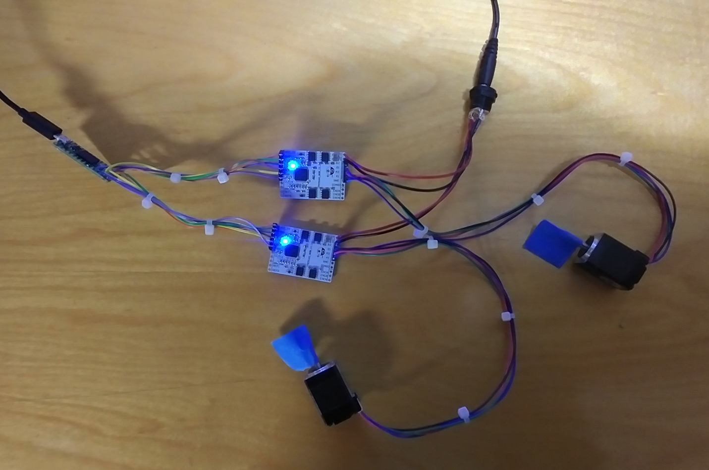

# Trinamic TMC5160_BOB on Teensy 4.0 running CircuitPython

Francis Deck, 5. Oct, 2022

## Overview

This is a rudimentary driver library and test program for controlling a Trinamic TMC5160 chip as found on the TMC5160_BOB breakout board. It provides functions for setting up speed, acceleration, and coil currents, and performs absolute position moves in microsteps. I've also implemented and tested support for a quadrature rotary encoder on the BOB, but not closed loop encoder feedback.

**Do not use this project for safety critical applications**. This project has not been reviewed or approved by an engineer. The design and code are not known to be free of errors that could cause unintentional operation of motors, or hardware damage. In fact, the demo code if used as-is will run the motors spontaneously when your computer wakes up from sleep, or when the CircuitPython virtual drive is accessed.

## Project approach

My approach to embedded projects is "get coding quickly." What I mean is that I do not start with hardware design. I start with building the simplest prototype that will let me write and testing code. My rationale is that code testing will often uncover the need for hardware changes. Also, I can abandon a project before spending money on things like printed circuits and enclosures.

In this case, I left the project with the earliest prototype that worked, and have not found an application yet, that demands a more robust hardware design.

## References

Datasheets for the TMC5160 chip, and the TMC5160_BOB breakout board are found at the Trinamic website:

https://www.trinamic.com/support/eval-kits/details/tmc5160-bob/

CircuitPython for Teensy 4.0:

https://circuitpython.org/board/teensy40/

## Preliminaries

Familiarize yourself with CircuitPython before trying to use this project. There are lots of great tutorials. I'm going to assume that you know how to do things like copy files and enter commands into the REPL.

Satisfy yourself that your CP installation is working by itself before installing any of my stuff.

## Hardware

The schematic shows the basic wiring. The Teensy needs to be connected to a PC in order to receive power. The power supply labeled **+12 V** could be a range of voltages as indicated in the TMC5160_BOB datasheet. The current rating is determined by what motors and drive currents you're using. Make sure you use a power supply with built-in current limiting.

## Software

I don't think there's a great way to clone this repo directly to the CircuitPython virtual drive. The reason is that the total collection of files will exceed the drive space. For this reason, I recommend cloning this repo and then copying individual project files to the CP drive. The **Python** directory will contain my project folders, of which there is presently only one.

### TestProject

* **lib/tmc5160.py** is the code package that abstracts the TMC5160 functions into a class. It's the most general-purpose of the libraries.

* **lib/motors.py** is a program that I wrote for easily controlling two motors from the REPL.

**Installation**: Copy both of these files into the **lib** directory of the CP virtual drive.

**Usage**: Connect the power supply to Vs on the board. As a reminder, this will typically be something like +12 V. Connect the USB cable to the Teensy. Since you've already been playing with CP, you know the COM port number of your project, and can open a terminal (such as PuTTY) to that COM port address. You'll see something like:

	Auto-reload is on. Simply save files over USB to run them or enter REPL to disable.

	Press any key to enter the REPL. Use CTRL-D to reload.

	Adafruit CircuitPython 7.3.3 on 2022-08-29; Teensy 4.0 with IMXRT1062DVJ6A
	
Press any key to enter the REPL. Try entering the following commands:

	from motors import x, y
	x.moveAbsolute(10000)
	y.moveAbsolute(-50000)

That's it for the first demo.

## License

MIT License

Copyright (c) 2022 bassistTech

Permission is hereby granted, free of charge, to any person obtaining a copy
of this software and associated documentation files (the "Software"), to deal
in the Software without restriction, including without limitation the rights
to use, copy, modify, merge, publish, distribute, sublicense, and/or sell
copies of the Software, and to permit persons to whom the Software is
furnished to do so, subject to the following conditions:

The above copyright notice and this permission notice shall be included in all
copies or substantial portions of the Software.

THE SOFTWARE IS PROVIDED "AS IS", WITHOUT WARRANTY OF ANY KIND, EXPRESS OR
IMPLIED, INCLUDING BUT NOT LIMITED TO THE WARRANTIES OF MERCHANTABILITY,
FITNESS FOR A PARTICULAR PURPOSE AND NONINFRINGEMENT. IN NO EVENT SHALL THE
AUTHORS OR COPYRIGHT HOLDERS BE LIABLE FOR ANY CLAIM, DAMAGES OR OTHER
LIABILITY, WHETHER IN AN ACTION OF CONTRACT, TORT OR OTHERWISE, ARISING FROM,
OUT OF OR IN CONNECTION WITH THE SOFTWARE OR THE USE OR OTHER DEALINGS IN THE
SOFTWARE.